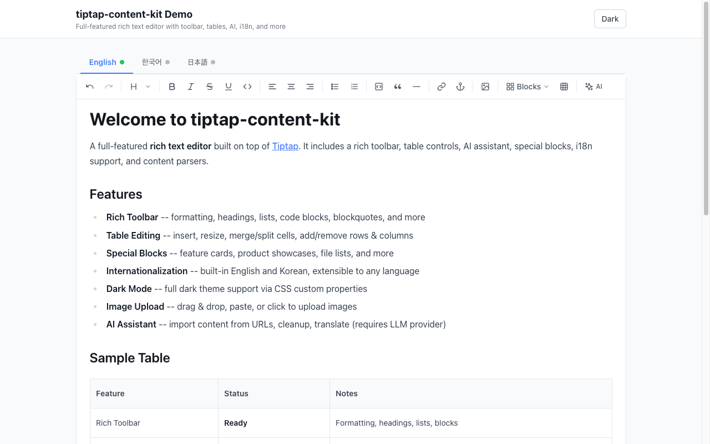
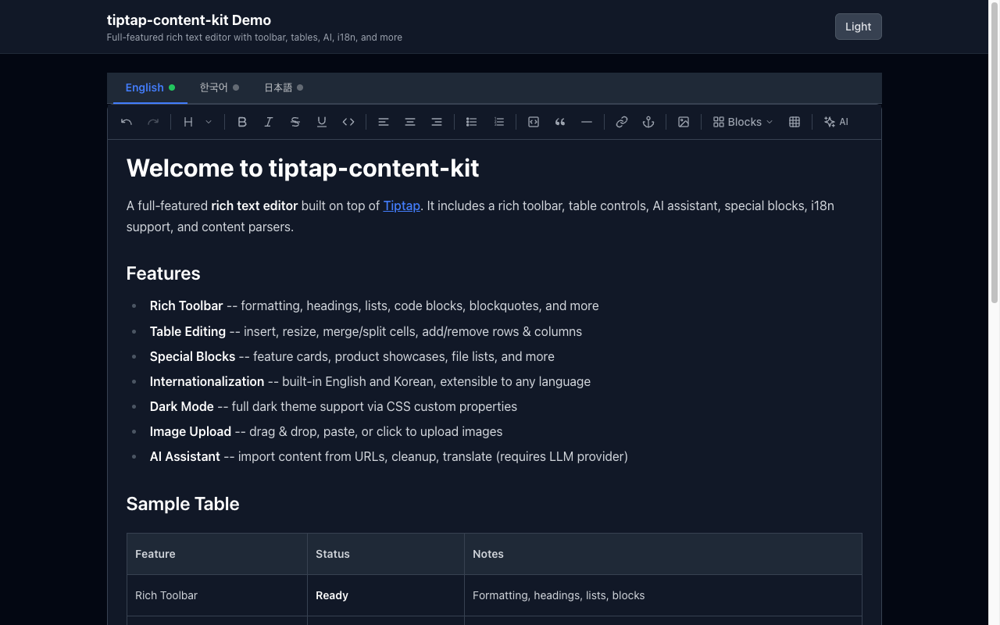
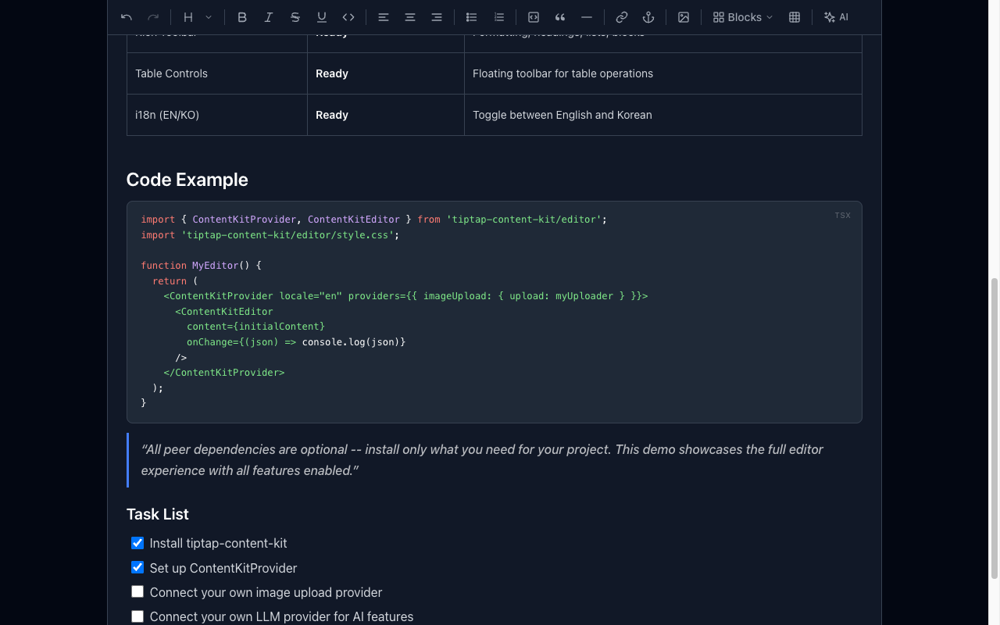
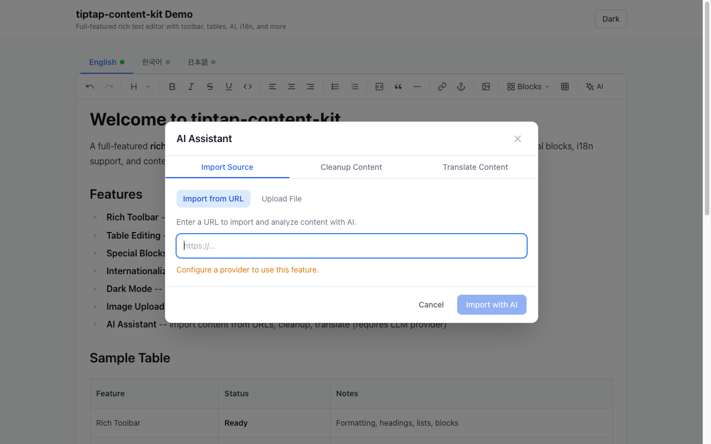

# tiptap-content-kit

Full-featured Tiptap editor with rich toolbar, AI assistant, table controls, special blocks, i18n, dark mode, and production-hardened content parsers.

[](https://www.npmjs.com/package/tiptap-content-kit)
[](./LICENSE)
[](https://www.typescriptlang.org/)

## Features

- **Rich Editor Component** -- Drop-in React editor with toolbar, table controls, code blocks, AI assistant, and special blocks
- **5 content parsers** -- Markdown, DOCX, DOC, PDF, and Confluence Storage Format (XHTML to blocks or Markdown)
- **10 Tiptap editor extensions** -- React & Vue 3 support. Callout, Diagram (Mermaid/PlantUML), CodeBlockTabs, ResizableImage, HtmlEmbed, Embed (Figma), YouTube, Anchor, DocumentLink, MarkdownShortcuts
- **Block schema with validation** -- Canonical block types, sanitization pipeline, AI output validation
- **AI-powered features** -- Translation (7 languages), content cleanup, URL/file import, document search
- **Dark mode** -- CSS variable-based theming with `.dark` class toggle
- **i18n** -- Built-in English and Korean, extensible to any language
- **Utility functions** -- HTML sanitizer for sandboxed iframes, Figma URL parser with Embed Kit 2.0 support
- **Provider interfaces** -- Plug in your own LLM, image upload, Confluence OAuth, and storage providers

## Screenshots

| Light Mode | Dark Mode |
| :---: | :---: |
|  |  |

| Code Blocks & Syntax Highlighting | AI Assistant |
| :---: | :---: |
|  |  |

## Installation

```bash
npm install tiptap-content-kit

# or
pnpm add tiptap-content-kit

# or
yarn add tiptap-content-kit
```

### Peer Dependencies

All peer dependencies are **optional** -- install only what you need:

```bash
# For the Editor component (React)
npm install @tiptap/react @tiptap/core @tiptap/starter-kit @tiptap/extension-underline @tiptap/extension-text-align @tiptap/extension-table @tiptap/extension-table-row @tiptap/extension-table-cell @tiptap/extension-table-header @tiptap/extension-link @tiptap/extension-image @tiptap/extension-placeholder @tiptap/extension-task-list @tiptap/extension-task-item @tiptap/extension-code-block-lowlight lowlight react react-dom

# For Tiptap extensions only (React)
npm install @tiptap/core @tiptap/react react react-dom

# For Tiptap extensions only (Vue 3)
npm install @tiptap/core @tiptap/vue-3 vue

# For DOCX parsing
npm install mammoth

# For legacy .doc parsing
npm install word-extractor

# For PDF parsing
npm install pdf-parse

# For Diagram extension
npm install mermaid
```

## Editor Component (React)

A batteries-included rich text editor built on Tiptap.

### Basic Usage

```tsx
import { ContentKitProvider, ContentKitEditor } from 'tiptap-content-kit/editor';
import 'tiptap-content-kit/editor/style.css';

function MyEditor() {
  return (
    <ContentKitProvider locale="en" providers={{}}>
      <ContentKitEditor
        content={initialContent}
        onChange={(json) => console.log(json)}
        editable={true}
        placeholder="Start writing..."
      />
    </ContentKitProvider>
  );
}
```

### ContentKitEditor Props

| Prop | Type | Default | Description |
| ---- | ---- | ------- | ----------- |
| `content` | `any` (Tiptap JSON) | `undefined` | Initial editor content |
| `onChange` | `(content: any) => void` | `undefined` | Called on content change |
| `editable` | `boolean` | `true` | Enable/disable editing |
| `placeholder` | `string` | `"Start writing..."` | Placeholder text |
| `locale` | `string` | `"en"` | Editor UI language (en, ko) |
| `className` | `string` | `undefined` | Additional CSS classes |
| `onImageUpload` | `(file: File) => Promise<string>` | `undefined` | Image upload handler |
| `extensions` | `any[]` | `[]` | Additional Tiptap extensions |
| `toolbarClassName` | `string` | `undefined` | Toolbar wrapper CSS classes |
| `editorClassName` | `string` | `undefined` | Editor content CSS classes |

### ContentKitProvider Props

| Prop | Type | Default | Description |
| ---- | ---- | ------- | ----------- |
| `locale` | `string` | `"en"` | UI language |
| `providers` | `EditorProviders` | `{}` | Service providers |
| `messages` | `Record<string, EditorMessages>` | `{}` | Custom i18n messages |
| `supportedLocales` | `EditorLocale[]` | `[{code:'en',...},{code:'ko',...}]` | Available locales |

## Multi-Locale Editor

`MultiLocaleEditor` wraps `ContentKitEditor` with locale tabs. When only one locale is configured, no tabs are shown and it behaves like a single editor. When multiple locales are configured, each tab manages its own content independently.

### Basic Usage (Single Editor -- No Tabs)

```tsx
import { ContentKitProvider, MultiLocaleEditor } from 'tiptap-content-kit/editor';
import 'tiptap-content-kit/editor/style.css';

function MyEditor() {
  const [contents, setContents] = useState<Record<string, any>>({
    en: initialContent,
  });

  return (
    <ContentKitProvider locale="en" providers={{}}>
      <MultiLocaleEditor
        locales={[{ code: 'en', label: 'English' }]}
        contents={contents}
        onChange={setContents}
      />
    </ContentKitProvider>
  );
}
```

### Multi-Locale with Tabs

```tsx
import { ContentKitProvider, MultiLocaleEditor } from 'tiptap-content-kit/editor';
import 'tiptap-content-kit/editor/style.css';

function MyEditor() {
  const [contents, setContents] = useState<Record<string, any>>({
    en: initialContent,
  });

  return (
    <ContentKitProvider
      locale="en"
      providers={myProviders}
      supportedLocales={[
        { code: 'en', label: 'English' },
        { code: 'ko', label: '한국어' },
        { code: 'ja', label: '日本語' },
      ]}
    >
      <MultiLocaleEditor
        locales={[
          { code: 'en', label: 'English' },
          { code: 'ko', label: '한국어' },
          { code: 'ja', label: '日本語' },
        ]}
        defaultLocale="en"
        contents={contents}
        onChange={setContents}
        placeholder="Start writing..."
      />
    </ContentKitProvider>
  );
}
```

Each tab shows a colored dot: green when the locale has content, gray when empty. AI translation with "Cross Tab" mode automatically writes the translated result into the target locale tab.

### MultiLocaleEditor Props

| Prop | Type | Default | Description |
| ---- | ---- | ------- | ----------- |
| `locales` | `EditorLocale[]` | required | Locale tabs to display. If only 1, no tabs shown. |
| `defaultLocale` | `string` | First locale code | Initial active locale |
| `contents` | `Record<string, any>` | `{}` | Content per locale: `{ en: tiptapJSON, ko: tiptapJSON }` |
| `onChange` | `(contents: Record<string, any>) => void` | `undefined` | Called when any locale's content changes |
| `placeholder` | `string` | `undefined` | Placeholder text for empty editors |
| `editable` | `boolean` | `true` | Enable/disable editing |
| ...other | | | All `ContentKitEditor` props are passed through |

> **Note:** Pass `supportedLocales` to `ContentKitProvider` as well -- the AI translation modal uses it to populate the target language dropdown.

## AI Features

AI features are enabled by passing providers to `ContentKitProvider`.

### EditorProviders Interface

```typescript
interface EditorProviders {
  llm?: LLMProvider;                    // Required for AI features
  imageUpload?: ImageUploadProvider;    // Image upload
  cleanupContent?: (content: any, options: CleanupOptions) => Promise<{ blocks: any[]; changes: string[] }>;
  translateContent?: (content: any, sourceLang: string, targetLang: string) => Promise<{ blocks: any[]; title?: string }>;
  importContent?: (url: string) => Promise<{ blocks: any[]; title?: string }>;
  importFile?: (file: File) => Promise<{ blocks: any[]; title?: string }>;
  searchDocuments?: (query: string) => Promise<DocumentSearchResult[]>;
  onNotify?: (message: string, type: 'info' | 'success' | 'warning' | 'error') => void;
}
```

### AI Provider Example (Anthropic Claude)

```tsx
import Anthropic from '@anthropic-ai/sdk';

const anthropic = new Anthropic();

const providers: EditorProviders = {
  llm: {
    generateText: async (prompt, options) => {
      const res = await anthropic.messages.create({
        model: 'claude-sonnet-4-20250514',
        max_tokens: options?.maxTokens ?? 4096,
        system: options?.systemPrompt,
        messages: [{ role: 'user', content: prompt }],
      });
      return res.content[0].type === 'text' ? res.content[0].text : '';
    },
  },

  cleanupContent: async (content, options) => {
    // Send content to your AI backend for cleanup
    const res = await fetch('/api/cleanup', {
      method: 'POST',
      body: JSON.stringify({ content, options }),
    });
    return res.json(); // { blocks: [...], changes: [...] }
  },

  translateContent: async (content, sourceLang, targetLang) => {
    const res = await fetch('/api/translate', {
      method: 'POST',
      body: JSON.stringify({ content, sourceLang, targetLang }),
    });
    return res.json(); // { blocks: [...], title?: "..." }
  },
};

<ContentKitProvider locale="en" providers={providers}>
  <ContentKitEditor content={content} onChange={setContent} />
</ContentKitProvider>
```

### Image Upload

Via provider:

```tsx
const providers: EditorProviders = {
  imageUpload: {
    upload: async (file: File) => {
      const formData = new FormData();
      formData.append('file', file);
      const res = await fetch('/api/upload', { method: 'POST', body: formData });
      const { url } = await res.json();
      return url; // Return the URL of the uploaded image
    },
  },
};
```

Or via the `onImageUpload` prop on `ContentKitEditor`:

```tsx
<ContentKitEditor
  onImageUpload={async (file) => {
    const formData = new FormData();
    formData.append('file', file);
    const res = await fetch('/api/upload', { method: 'POST', body: formData });
    const { url } = await res.json();
    return url;
  }}
/>
```

## Editor Features

### Rich Toolbar

Formatting (bold, italic, underline, strikethrough), headings (H1--H4), text alignment, ordered/unordered lists, task lists, code blocks, blockquotes, horizontal rules, images, links, anchors, and special blocks.

### Table Editing

Insert tables, add/remove rows and columns, merge/split cells, toggle header rows/columns, and resize columns.

### Code Blocks

Syntax highlighting powered by lowlight with 27 supported languages. Includes a language selector dropdown in each code block.

### AI Assistant

- **Translation** -- 7 languages supported
- **Content cleanup** -- Restructure, reformat, summarize, add callouts
- **URL import** -- Import content from any URL
- **File import** -- Import from uploaded files

### Special Blocks

Feature card, product showcase, file list, doc list, and more structured content blocks.

### Dark Mode

Add the `dark` class to a parent element:

```html
<div class="dark">
  <ContentKitProvider locale="en" providers={{}}>
    <ContentKitEditor content={content} onChange={setContent} />
  </ContentKitProvider>
</div>
```

The editor uses CSS variables for theming, so it adapts automatically.

### i18n

Built-in support for English (`en`) and Korean (`ko`). Add custom locales:

```tsx
<ContentKitProvider
  locale="ja"
  messages={{
    ja: {
      'toolbar.bold': '\u592A\u5B57',
      'toolbar.italic': '\u659C\u4F53',
      // ... see i18n/en.ts for all keys
    },
  }}
  supportedLocales={[
    { code: 'en', label: 'English' },
    { code: 'ko', label: '\uD55C\uAD6D\uC5B4' },
    { code: 'ja', label: '\u65E5\u672C\u8A9E' },
  ]}
>
  <ContentKitEditor content={content} onChange={setContent} />
</ContentKitProvider>
```

## Quick Start

### Parsing Markdown

```typescript
import { markdownToBlocks } from 'tiptap-content-kit/parsers';

const blocks = markdownToBlocks('# Hello World\n\nThis is a paragraph.');
// => [{ type: 'heading', level: 1, content: 'Hello World' }, { type: 'paragraph', content: '...' }]
```

### Parsing Files (DOCX, PDF, DOC, TXT)

```typescript
import { parseFile, isSupportedFileType } from 'tiptap-content-kit/parsers';

if (isSupportedFileType('report.docx', 'application/vnd.openxmlformats-officedocument.wordprocessingml.document')) {
  const result = await parseFile(
    buffer,
    'report.docx',
    'application/vnd.openxmlformats-officedocument.wordprocessingml.document'
  );
  console.log(result.title);       // "report"
  console.log(result.fileType);    // "docx"
  console.log(result.contentHtml); // HTML string (DOCX only)
  console.log(result.charCount);   // character count
}
```

### DOCX HTML to Blocks

```typescript
import { docxHtmlToBlocks } from 'tiptap-content-kit/parsers';

// Convert mammoth HTML output directly to document blocks
const blocks = docxHtmlToBlocks(mammothHtml);
```

### Parsing Confluence

```typescript
import { parseConfluenceContent } from 'tiptap-content-kit/parsers';

const { blocks } = parseConfluenceContent(confluenceXhtml, {
  siteUrl: 'https://your-site.atlassian.net',
  spaceKey: 'SPACE',
});
```

### Confluence to Markdown

```typescript
import { parseConfluenceStorageToMarkdown } from 'tiptap-content-kit/parsers';

const markdown = parseConfluenceStorageToMarkdown(storageFormatXhtml, {
  siteUrl: 'https://your-site.atlassian.net',
  spaceKey: 'DOCS',
});
```

### Using Tiptap Extensions (React)

```typescript
import { CalloutExtension, DiagramExtension, ResizableImage } from 'tiptap-content-kit/extensions';
import StarterKit from '@tiptap/starter-kit';
import { useEditor } from '@tiptap/react';

const editor = useEditor({
  extensions: [
    StarterKit,
    CalloutExtension,
    DiagramExtension,
    ResizableImage,
  ],
});
```

### Using Tiptap Extensions (Vue 3)

```typescript
import { CalloutExtension, DiagramExtension, ResizableImage } from 'tiptap-content-kit/extensions-vue';
import StarterKit from '@tiptap/starter-kit';
import { useEditor } from '@tiptap/vue-3';

const editor = useEditor({
  extensions: [
    StarterKit,
    CalloutExtension,
    DiagramExtension,
    ResizableImage,
  ],
});
```

### Block Schema & Validation

```typescript
import { BLOCK_TYPES, isValidBlockType, sanitizeBlock } from 'tiptap-content-kit/schema';
import { validateAIOutput } from 'tiptap-content-kit/schema';

// Check a block type
isValidBlockType('heading');   // true
isValidBlockType('unknown');   // false

// Validate and sanitize AI-generated blocks
const { blocks, corrections, blockTypesUsed } = validateAIOutput(rawBlocks);
// corrections: ["Fixed invalid callout variant 'note' -> 'info'", ...]
```

### Utilities

```typescript
import { sanitizeHtmlForEmbed } from 'tiptap-content-kit/utils';
import { parseFigmaUrl, buildFigmaEmbedUrl } from 'tiptap-content-kit/utils';

// Sanitize HTML for sandboxed iframe rendering
const safeHtml = sanitizeHtmlForEmbed(rawHtml);

// Parse a Figma URL and build an embed URL (Embed Kit 2.0)
const info = parseFigmaUrl('https://www.figma.com/design/abc123/MyFile');
const embedUrl = buildFigmaEmbedUrl(info, 'my-app');
// => "https://embed.figma.com/design/abc123?embed-host=my-app"
```

## API Reference

### Subpath Exports

| Import Path | Contents |
| ----------- | -------- |
| `tiptap-content-kit/editor` | `ContentKitEditor`, `MultiLocaleEditor`, `ContentKitProvider`, `EditorToolbar`, `TableControls`, `SmartLinkModal`, `AnchorModal`, `DiagramEditModal`, `AIImportModal`, `SpecialBlockExtension`, `Tooltip`, `IconPicker`, i18n utilities, and all editor types |
| `tiptap-content-kit/editor/style.css` | Editor stylesheet (required for the editor component) |
| `tiptap-content-kit/parsers` | `parseFile`, `markdownToBlocks`, `docxHtmlToBlocks`, `parseConfluenceContent`, `parseConfluenceStorageToMarkdown`, and more |
| `tiptap-content-kit/schema` | `BLOCK_TYPES`, `DocumentBlock`, `sanitizeBlock`, `isValidBlockType`, `validateAIOutput` |
| `tiptap-content-kit/extensions` | React: `CalloutExtension`, `DiagramExtension`, `CodeBlockTabsExtension`, `HtmlEmbedExtension`, `EmbedExtension`, `ResizableImage`, `YoutubeEmbed`, `AnchorExtension`, `DocumentLinkList`, `MarkdownShortcuts` |
| `tiptap-content-kit/extensions-vue` | Vue 3: Same extensions as above (Vue 3 + @tiptap/vue-3) |
| `tiptap-content-kit/utils` | `sanitizeHtmlForEmbed`, `parseFigmaUrl`, `buildFigmaEmbedUrl` |
| `tiptap-content-kit/providers` | `ContentKitConfig`, `ConfluenceConfig`, `LLMProvider`, `StorageProvider` |

### Block Types

The schema defines 17 block types:

`heading` | `paragraph` | `code` | `callout` | `list` | `table` | `divider` | `image` | `blockquote` | `youtube` | `video` | `tabbed-code` | `file` | `diagram` | `anchor` | `html` | `embed`

Plus 4 special block types for landing pages:

`quick-start-card` | `feature-card` | `feature-grid` | `doc-list`

## Configuration

Use the `ContentKitConfig` interface to wire up external services for parsers and server-side usage. All providers are optional.

```typescript
import type { ContentKitConfig } from 'tiptap-content-kit/providers';

const config: ContentKitConfig = {
  confluence: { ... },
  llm: { ... },
  storage: { ... },
};
```

### Confluence OAuth

```typescript
const config: ContentKitConfig = {
  confluence: {
    getCredentials: async (userId: string) => {
      const token = await db.getConfluenceToken(userId);
      return {
        accessToken: token.access_token,
        cloudId: token.cloud_id,
        siteUrl: `https://api.atlassian.com/ex/confluence/${token.cloud_id}`,
      };
    },
  },
};
```

### LLM Provider

The `LLMProvider` interface works with **any LLM** -- OpenAI, Anthropic Claude, Google Gemini, Ollama, or any other provider. Just implement the `generateText` function.

For editor-level AI features (translation, cleanup, import), see the [AI Features](#ai-features) section.

#### OpenAI

```typescript
import OpenAI from 'openai';
const openai = new OpenAI();

const config: ContentKitConfig = {
  llm: {
    generateText: async (prompt, options) => {
      const res = await openai.chat.completions.create({
        model: 'gpt-4o-mini',
        temperature: options?.temperature ?? 0.3,
        max_tokens: options?.maxTokens,
        messages: [
          ...(options?.systemPrompt ? [{ role: 'system' as const, content: options.systemPrompt }] : []),
          { role: 'user' as const, content: prompt },
        ],
      });
      return res.choices[0]?.message?.content ?? '';
    },
  },
};
```

#### Anthropic Claude

```typescript
import Anthropic from '@anthropic-ai/sdk';
const anthropic = new Anthropic();

const config: ContentKitConfig = {
  llm: {
    generateText: async (prompt, options) => {
      const res = await anthropic.messages.create({
        model: 'claude-sonnet-4-20250514',
        max_tokens: options?.maxTokens ?? 4096,
        system: options?.systemPrompt,
        messages: [{ role: 'user', content: prompt }],
      });
      return res.content[0].type === 'text' ? res.content[0].text : '';
    },
  },
};
```

#### Google Gemini

```typescript
import { GoogleGenAI } from '@google/genai';
const ai = new GoogleGenAI({ apiKey: process.env.GEMINI_API_KEY! });

const config: ContentKitConfig = {
  llm: {
    generateText: async (prompt, options) => {
      const res = await ai.models.generateContent({
        model: 'gemini-2.0-flash',
        contents: [{ role: 'user', parts: [{ text: prompt }] }],
        config: {
          systemInstruction: options?.systemPrompt,
          temperature: options?.temperature ?? 0.3,
          maxOutputTokens: options?.maxTokens,
        },
      });
      return res.text ?? '';
    },
  },
};
```

#### Ollama (Local)

```typescript
const config: ContentKitConfig = {
  llm: {
    generateText: async (prompt, options) => {
      const res = await fetch('http://localhost:11434/api/generate', {
        method: 'POST',
        body: JSON.stringify({
          model: 'llama3',
          prompt: options?.systemPrompt ? `${options.systemPrompt}\n\n${prompt}` : prompt,
          stream: false,
          options: { temperature: options?.temperature ?? 0.3 },
        }),
      });
      const data = await res.json();
      return data.response;
    },
  },
};
```

### Storage (S3 Example)

```typescript
import { S3Client, PutObjectCommand } from '@aws-sdk/client-s3';

const s3 = new S3Client({ region: 'us-east-1' });

const config: ContentKitConfig = {
  storage: {
    upload: async (buffer, key, contentType) => {
      await s3.send(new PutObjectCommand({
        Bucket: 'my-uploads-bucket',
        Key: `images/${key}`,
        Body: buffer,
        ContentType: contentType,
      }));
      return `https://my-uploads-bucket.s3.amazonaws.com/images/${key}`;
    },
  },
};
```

## Supported File Types

| Format | Extension | MIME Type | Parser |
| ------ | --------- | --------- | ------ |
| Markdown | `.md`, `.mdx` | `text/markdown` | `markdownToBlocks` |
| Word (OOXML) | `.docx` | `application/vnd.openxmlformats-officedocument.wordprocessingml.document` | `mammoth` + `docxHtmlToBlocks` |
| Word (Legacy) | `.doc` | `application/msword` | `word-extractor` |
| PDF | `.pdf` | `application/pdf` | `pdf-parse` |
| Plain Text | `.txt`, `.text` | `text/plain` | Built-in |
| Confluence | -- | Storage Format XHTML | `parseConfluenceContent` / `parseConfluenceStorageToMarkdown` |

## Contributing

Contributions are welcome! Here's how to get started:

```bash
# 1. Clone the repo and install all dependencies (including devDependencies)
git clone https://github.com/studiotemple/tiptap-content-kit.git
cd tiptap-content-kit
npm install

# 2. Run the build
npm run build

# 3. Run TypeScript type checking
npm run typecheck

# 4. Watch mode for development
npm run dev
```

**Key notes for contributors:**

- All peer dependencies (`@tiptap/core`, `@tiptap/react`, `mermaid`, etc.) are installed automatically as `devDependencies` for the build -- you don't need to install them separately.
- When adding new parsers, export them from `src/parsers/index.ts`.
- When adding new extensions, export them from `src/extensions/index.ts` (React) and `src/extensions-vue/index.ts` (Vue 3).
- Editor components go in `src/editor/` and are exported from `src/editor/index.ts`.
- Block types must be registered in `src/schema/block-schema.ts` (`BLOCK_TYPES` array).
- Please run `npm run typecheck` before submitting a PR to ensure zero type errors.

## Built with Claude Code

This project was developed with the assistance of [Claude Code](https://claude.ai/), Anthropic's AI-powered coding agent.

## License

MIT -- see [LICENSE](./LICENSE) for details.
